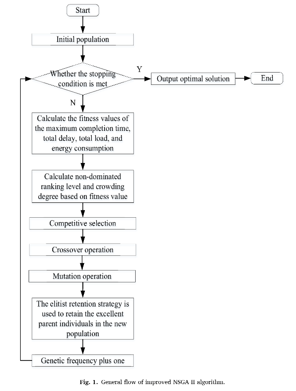

# NSGA II workshop scheduling

The current project is a C++ implementation of the NSGA II workshop scheduling algorithm. The main source of documentation used to research the topic and algorithm can be found [here](#ma)

### TABLE OF CONTESTS

- [Build and run](#build-and-run)
- [Utilization](#utilization)
- [Abstract](#abstract)
- [Algorithm representation](#algorithm-representation)
- [Documentation](#documentation)
- [Further improvements](#further-improvements)

## **Build and run**

<b>IMPORTANT:</b>

Ensure you have GCC/make installed on your system: `sudo apt-get install build-essential`

**Automatic:**

- In order to build and run the algorithm run the following cmd inside the repository: `make buildAndRun`

**Manual:**

- Build the project: `make build`

- Run the algorithm: `make run`

  **_OR_**

- Without using make: `g++ -Wall -Werror ./src/NSGA2.cpp -o NSGA2 && ./NSGA2`

## **Utilization**

The prompt will require the following entry arguments:

- n - sets the range [1, n] that represents the values that can be assigned to processes
- m - sets the range [1, m] that represents the values that can be assigned to machines
- itterations - represents the number of iterations/generations of the algorithm
- sampleSize - represents the initial population size
- numberOfProcesses - represents the number of processes assigned to each "individual". For each process a machine is generated. 2\*numberOfProcesses represents the total amount of "genes"

After entering the values, the algorithm will go through each step described <a href="#algorithm-representation">bellow</a>, pausing at every step.

## **Abstract**

Based on the study of multi-objective flexible workshop scheduling problem and the learning of traditional genetic
algorithm, a <b>non-dominated sorting genetic algorithm</b> is proposed to solve and optimize the scheduling model with the
objective functions of processing cycle, advance/delay penalty and processing cost. In the process of optimization, nondominated fast ranking operator and competition operator are used to select the descendant operator, which improves
the computational efficiency and optimization ability of the algorithm. Non-repetitive non-dominant solutions and
frontier sets are found in the iteration operation to retain the optimal results. Finally, taking a manufacturing workshop
as an example, the practicability of the proposed algorithm is verified by the simulation operation of the workshop
scheduling information and the comparison with other algorithms. The results show that the algorithm can obtain the
optimal solution more quickly than the unimproved algorithm. The improved algorithm is faster and more effective in
searching, and has certain feasibility in solving the job shop scheduling problem, which is more suitable for industrial
processing and production.

## **Algorithm representation**

## **Documentation**

- [NSGA2-intelligent workshop resource scheduling](./documentation/NSGA2-intelligent%20workshop%20resource%20scheduling.pdf) **(main article for current project implementation)** 

- [NSGA2-multi-objective casting production scheduling](./documentation/NSGA2-multi-objective%20casting%20production%20scheduling.pdf)
- [NSGA2-multi-objective flexible workshop scheduling](./documentation/NSGA2-multi-objective%20flexible%20workshop%20scheduling.pdf)
- [NSGA2-supplier selection and production planning](./documentation/NSGA2-supplier%20selection%20and%20production%20planning.pdf)

## **Further improvements**

- grouping of final solutions and criteria for generating valid indiviuals can be improved (Steps 6&7)
- improve output of the algorithm to be easier to track the steps
- allow output to file

<a href="#readme-top">(back to top)</a>

